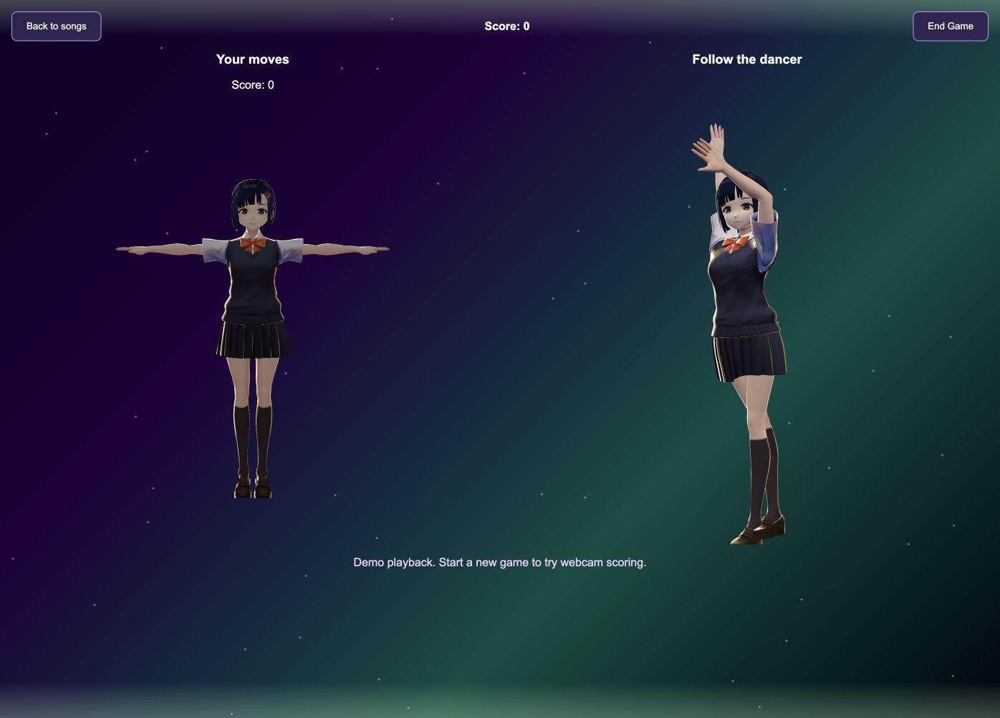

# Dance Heroes

**Follow the dancer. Match the moves. Become a Dance Hero.**

A browser dance game with 3D avatars, webcam motion capture, and pose-based scoring. Built by **Jason Shao, Isaac Hu, and Colin Song**.

**🏆 Committee's Choice Winner — McGill CodeJam 14** · [Award and project submission](https://devpost.com/software/dance-heroes)

[Devpost project](https://devpost.com/software/dance-heroes) · [Download source ZIP](https://github.com/IHu04/DanceHeroes/archive/refs/heads/main.zip) · [Run locally](#run-locally)

## Gameplay preview



The app playing the bundled routine in **Watch demo** mode. Start a camera game to control the left avatar.

## Current status

- **Bundled demo:** play the included dance animation and soundtrack without downloading AI model weights.
- **Watch mode:** preview the dancer without enabling a webcam.
- **Camera gameplay:** MediaPipe and Kalidokit map your movement onto a VRM avatar; follow the dancer to earn points.
- **Results:** end the game to see your score and play again.
- **Optional music generation:** connect a separately installed EDGE-to-FBX adapter to enable WAV uploads.

The bundled demo runs locally. Custom music generation requires an external EDGE setup and the optional adapter described below.

## Run locally

### Requirements

- **Node.js 22.13+ LTS** (or Node.js 24+) and npm
- **Python 3.10+**, including `venv` and pip
- A modern browser with WebGL; a webcam for camera gameplay
- Internet access for installation and MediaPipe's first runtime/model load

### Download

Either download and extract the [source ZIP](https://github.com/IHu04/DanceHeroes/archive/refs/heads/main.zip), or clone:

```bash
git clone https://github.com/IHu04/DanceHeroes.git
cd DanceHeroes
```

If using the ZIP, open a terminal in the extracted folder containing `package.json`. The ZIP includes the runnable app and skips the `experiments/` and extra `samples/`; cloning includes those folders.

### Install and launch

Run these commands from the repository root:

```bash
npm ci
npm run setup:backend
npm start
```

Open **http://127.0.0.1:5173**. The startup command runs the frontend and Flask backend together; press **Ctrl+C** to stop both.

The setup command uses `python3` on macOS/Linux and `python` on Windows. If your Python command points to an older installation, select the correct executable:

```bash
# macOS/Linux example
PYTHON=python3.12 npm run setup:backend
```

```powershell
# Windows PowerShell example
$env:PYTHON = "C:\Path\To\Python\python.exe"
npm run setup:backend
```

### Play

1. Select **Press to start**, then **Play demo dance**.
2. Wait for the avatar and dance to load.
3. Select **Watch demo** for playback, or **Start Game** for webcam scoring.
4. For camera gameplay, allow camera access and step back until your full body is visible.
5. Select **End Game** to see your score; choose **Play again** for another round.

Keep the app on localhost: browsers require a secure context for camera access. Webcam images are processed in the browser; the local backend receives bone coordinates for scoring.

## Project layout

```text
DanceHeroes/
├── frontend/             # The single runnable React + Vite app
│   ├── src/              # Screens, avatar tracking, dance playback
│   └── public/models/    # Bundled VRM avatar and FBX choreography
├── backend/              # Flask upload adapter, game sessions, scoring
│   └── tests/            # API and scoring regression tests
├── scripts/              # Cross-platform setup and startup commands
├── docs/                 # Gameplay preview
├── samples/              # Sample WAV audio
└── experiments/          # Experimental prototypes; not app entrypoints
```

## Stack

| Part | Technology |
| --- | --- |
| Interface | React 18, TypeScript, Vite |
| 3D rendering | Three.js, `@pixiv/three-vrm`, FBXLoader |
| Motion capture | MediaPipe Holistic, Kalidokit |
| Local API | Python, Flask |
| Optional choreography generation | External EDGE setup and an EDGE-to-FBX adapter |

## Optional: generate choreography for your own music

Install [EDGE](https://github.com/Stanford-TML/EDGE) and its required checkpoints/assets separately. Music-to-FBX conversion requires a working external adapter.

To connect your working pipeline, set `DANCE_GENERATOR_SCRIPT` to the absolute path of a Bash adapter before running `npm start`. The backend invokes it with two arguments:

```text
bash /absolute/path/to/adapter.sh /absolute/path/to/music.wav /absolute/path/to/dance.fbx
```

The adapter must write a nonempty FBX animation to the second path and exit successfully. The animation should use the EDGE/SMPL `m_avg_*` bone naming used by the bundled sample. The app then plays the uploaded audio and returned choreography together.

```bash
DANCE_GENERATOR_SCRIPT=/absolute/path/to/adapter.sh npm start
```

This optional path needs Bash, including on Windows. WAV uploads are limited to 50 MB; generation times out after 10 minutes. If no adapter is configured, the app explains the missing setup and keeps the bundled demo available.

## Development and checks

```bash
npm run build   # TypeScript checks and production frontend build
npm run lint    # Frontend lint checks
npm test        # Backend scoring and API tests
```

To serve a production frontend locally, run the backend and preview in separate terminals:

```bash
# macOS/Linux, from the repository root
.venv/bin/python backend/app.py
```

```bash
npm run preview --workspace frontend -- --host 127.0.0.1
```

On Windows, use `.venv\Scripts\python.exe backend\app.py` for the backend. The preview server proxies `/api` to port 5001, just like development.

## Troubleshooting

- **Python setup fails:** verify Python 3.10+ and `venv` are installed, then rerun `npm run setup:backend`.
- **Port already in use:** stop another server using 5173 or 5001, then restart.
- **Camera unavailable:** check browser/OS permission, use localhost, and close other apps using the camera. Watch mode works without a camera.
- **Avatar missing:** wait for the bundled model to load and check WebGL support.
- **Scoring unavailable:** confirm the backend started; start a new game after a backend restart.
- **Custom uploads disabled:** configure a working generation adapter, or play the bundled demo.

## Limitations and credits

Dance Heroes is a hackathon prototype. Scoring is a heuristic comparison of poses, not a calibrated dance judge. Sessions are local and kept in memory. The bundled soundtrack and choreography are demonstration assets; arbitrary music requires the external generation pipeline.

Dance Heroes is inspired by [SysMocap](https://github.com/xianfei/SysMocap) and [EDGE](https://github.com/Stanford-TML/EDGE). Avatar and dependency assets retain their respective authors' terms. See [asset credits](frontend/public/models/CREDITS.md).
